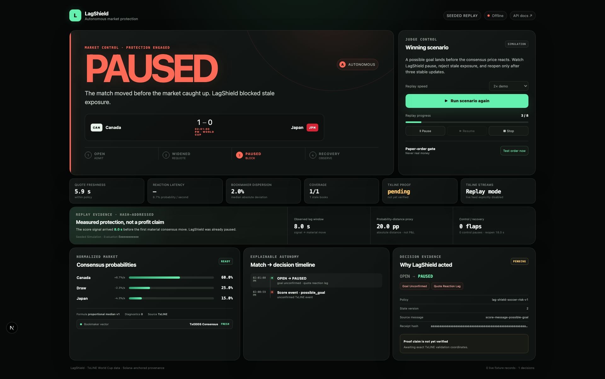

# LagShield

**An autonomous, proof-backed circuit breaker for in-play sports markets, powered by
TxLINE.**

When a possible goal, penalty, red card, or VAR event arrives before market consensus has
fully reacted, LagShield widens or pauses quoting, rejects unsafe paper orders, and reopens
only after deterministic recovery. Every action carries a reproducible decision receipt tied
to the exact TxLINE inputs and their Solana proof lifecycle.



> LagShield is a market-safety agent, not a winner-prediction model. The included execution
> adapter is simulated, never real money, and the seeded scenario is always labelled as a
> simulation.

## Submission links

| Judge resource        | Link / status                                                                                                                        |
| --------------------- | ------------------------------------------------------------------------------------------------------------------------------------ |
| Public command center | Added after the owner-approved deployment tracked in [#15](https://github.com/stunt101harm/lag-shield/issues/15)                     |
| Public agent API      | Added after deployment; Swagger UI is served at `/docs` and OpenAPI at `/openapi.json`                                               |
| Demo video            | Added after the final recording tracked in [#17](https://github.com/stunt101harm/lag-shield/issues/17)                               |
| Submission brief      | [Judge-ready copy, technical highlights, endpoint inventory, and claims](docs/submission.md)                                         |
| Source and plan       | [Public repository](https://github.com/stunt101harm/lag-shield) · [parent epic](https://github.com/stunt101harm/lag-shield/issues/1) |

## Why this matters

Match-changing score events and bookmaker consensus do not always move at the same instant.
That creates a stale-exposure window: a quoting engine can continue accepting an obsolete
price while the underlying match has already changed. Alerting a human is too slow for an
in-play control loop.

LagShield turns TxLINE's granular score and odds streams into an autonomous safety boundary:

1. ingest and durably normalize independent odds and score SSE streams;
2. compute exact de-vig probabilities, freshness, velocity, dispersion, and reaction lag;
3. apply a versioned `OPEN → WIDENED/PAUSED → RECOVERY → OPEN` state machine;
4. serialize the decision and paper-order gate under the same PostgreSQL market lock; and
5. attach a canonical receipt plus asynchronous TxLINE/Solana validation evidence.

The core is deterministic TypeScript—not an opaque model or an LLM. The same ordered facts,
policy configuration, and logical clock produce the same decisions and hashes.

## Evidence, not promises

The committed golden scenario exists so judges can see the complete product when no World
Cup match is live. It exercises the production normalizer, consensus engine, risk policy,
market gate, persistence, receipt, API, and realtime UI.

| Seeded result                       | Measured value | Honest interpretation                                      |
| ----------------------------------- | -------------: | ---------------------------------------------------------- |
| Event to material consensus move    |          8.0 s | Observed stale-exposure window in the fixed scenario       |
| Rejected-order probability distance |        20.0 pp | Absolute error proxy; **not P&L or a profit claim**        |
| Normal-play control window          |           59 s | Zero restrictive transitions before the protective signal  |
| Recovery behavior                   |        0 flaps | Three safe updates before deterministic reopen             |
| Reproducibility                     |   SHA-256 hash | Byte-stable report from committed inputs and configuration |

See the [evaluation methodology and limitations](docs/evaluation.md) and its committed
[golden report](docs/evaluation/golden-seeded.md).

## Two-minute judge path

1. Open the public command center and select **Run winning demo**.
2. Watch the possible-goal event move the market from `OPEN` to `PAUSED` before consensus
   catches up.
3. Select **Test order now** and confirm `ORDER_REJECTED_PAUSED` and `realMoney: false`.
4. Watch three stable updates move through `RECOVERY` to `OPEN` without a refresh.
5. Open the receipt to inspect reason codes, exact TxLINE message identity, payload hash, and
   proof status. Pending, unavailable, rejected, and error are never shown as verified.
6. Open `/docs`, `/ready`, and `/v1/evaluations/seeded` on the public agent.

The complete recording script is in the [command-center guide](docs/command-center.md).

## Reproduce locally

Prerequisites: Node.js 24 LTS, pnpm 11, and Docker with Compose for the full stack.

The deterministic engine and report need no database, TxLINE token, or network call:

```bash
corepack enable
pnpm install --frozen-lockfile
pnpm replay:seeded
pnpm evaluation:seeded -- --format markdown
```

Both root commands build their required workspace packages first, so this path works directly
after a clean locked install without generated files, a database, credentials, or network access.

Run the full command center and judge API:

```bash
cp .env.example .env
docker compose up -d postgres
pnpm db:migrate
pnpm dev
```

- Command center: http://localhost:3000
- Agent health/readiness: http://localhost:4000/health · http://localhost:4000/ready
- Swagger UI/OpenAPI: http://localhost:4000/docs · http://localhost:4000/openapi.json

Against the running agent, execute the complete HTTP proof:

```bash
LAGSHIELD_API_URL=http://localhost:4000 pnpm judge:smoke
```

It starts the seeded replay, waits for `PAUSED`, submits a paper order, verifies rejection,
waits for automatic recovery, and retrieves the persisted order and linked receipt.

## Architecture

| Workspace         | Responsibility                                                           |
| ----------------- | ------------------------------------------------------------------------ |
| `apps/agent`      | Long-running ingestion, strategy execution, replay, API, and persistence |
| `apps/web`        | Operator command center and judge-facing product experience              |
| `packages/core`   | Deterministic domain logic, consensus math, risk policy, and receipts    |
| `packages/txline` | TxLINE activation, API, SSE, history, and Solana proof integration       |
| `packages/shared` | Strict runtime configuration and shared contracts                        |

Apps depend inward on packages; `packages/core` imports no HTTP, database, or wall-clock
transport. Live, historical, and seeded sources enter the same normalized event and strategy
boundary while remaining explicitly namespaced.

Read [architecture, data flow, trust boundaries, and live/replay parity](docs/architecture.md)
or the detailed [domain and transaction model](docs/domain-model.md).

## TxLINE integration and proof truth

LagShield uses TxLINE for fixture discovery, live odds and scores, bounded historical replay,
and validation proof material. Authentication follows the documented same-network
subscription and guest-JWT flow. The exact nine HTTP endpoints and their code paths are
listed in the [submission brief](docs/submission.md#txline-endpoints-used).

Two cryptographic claims remain separate:

- LagShield's SHA-256 receipt proves which persisted facts produced a decision.
- TxLINE validation proves that a selected odds or score fact belongs to a Merkle root owned
  by the configured TxLINE Solana program.

The safety decision and paper order are not sent on-chain. Proof validation is a read-only
Solana simulation, and no position settles on-chain. See the precise
[proof-verification contract](docs/proof-verification.md).

## Production and quality evidence

The agent includes unattended stream recovery, fail-closed dependency behavior, durable
quarantine, transactional restart reconciliation, secret redaction, bounded retention,
rate/body limits, security headers, graceful shutdown, load smoke tests, and independent
readiness checks. Deployment is reproducible from the checked-in Render Blueprint.

```bash
pnpm check
pnpm test:e2e
pnpm docs:check
pnpm security:audit
```

CI runs the complete suite with PostgreSQL 17 and also builds the portable agent container.
Read the [production-readiness fault model](docs/production-readiness.md),
[deployment runbook](docs/deployment.md), and [TxLINE integration feedback](docs/txline-feedback.md).

## Documentation map

- [Strategy mathematics and state transitions](docs/risk-policy.md)
- [Market identity, exact probability math, and consensus](docs/market-consensus.md)
- [Simulated execution and atomic order admission](docs/simulated-market-control.md)
- [Live TxLINE ingestion and recovery](docs/live-ingestion.md)
- [Historical hydration and replay](docs/historical-replay.md)
- [Judge API, realtime SSE, and smoke flow](docs/agent-api.md)
- [Five-minute demo script and strict submission preflight](docs/demo-script.md)
- [Security policy](SECURITY.md) and [contribution guide](CONTRIBUTING.md)

## License

MIT
