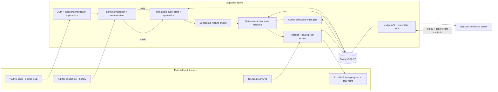
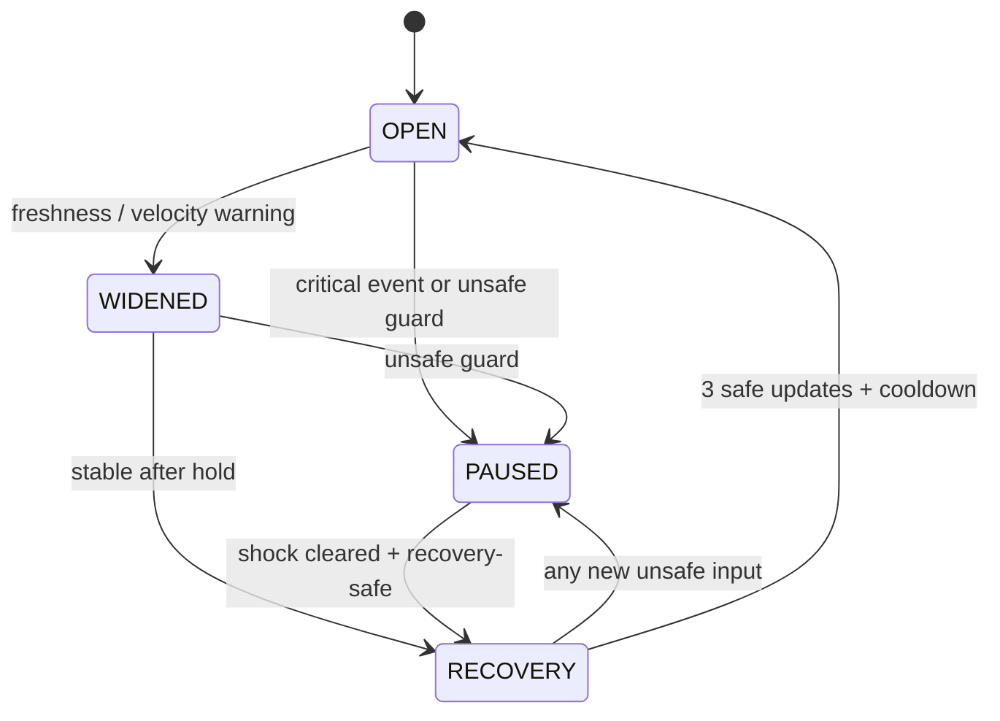

# Architecture, data flow, and trust boundaries

LagShield is a single-owner autonomous agent with separately deployable API/worker and web
processes. PostgreSQL is the source of durable truth. The browser is an untrusted read/control
client; it never receives TxLINE credentials, a signing key, or database access.

## End-to-end flow

## Decision sequence

1. Independent supervisors receive TxLINE odds and score SSE records. A stream can reconnect
   without stopping the other.
2. The transport schema rejects malformed/oversized records into durable quarantine. Valid
   inputs become immutable, versioned domain events before strategy dispatch.
3. The consensus engine converts documented `Pct` percentages to exact integer millionths,
   computes freshness/velocity/dispersion, and never guesses TxLINE's opaque native price
   scale.
4. The risk engine combines market features with score-event semantics and applies a pure,
   versioned transition table at the event's logical timestamp.
5. A PostgreSQL advisory lock serializes the decision, market state, and pending receipt.
   Paper-order admission takes the same market lock, making a pause-versus-order race atomic.
6. The proof worker requests exact TxLINE proof material and read-only simulates the pinned
   validation instruction against the configured Solana program. Safety never waits on RPC.
7. The API reads durable state and publishes bounded, resumable events to the command center.

## Trust boundaries

| Boundary                      | Trusted input                                                | Validation and failure behavior                                              |
| ----------------------------- | ------------------------------------------------------------ | ---------------------------------------------------------------------------- |
| TxLINE transport → agent      | Documented API host, authenticated SSE/HTTP payloads         | Strict schemas, 1 MiB frame cap, timeout, retry, durable quarantine          |
| Solana RPC → proof worker     | Matching network genesis, program-owned root account, return | Fail on genesis/owner/program/identity mismatch; never upgrade to `verified` |
| Agent → PostgreSQL            | Parameterized typed writes under explicit transactions       | No in-memory execution fallback; readiness becomes 503                       |
| Browser → public API          | Bounded replay and paper-order requests                      | Exact CORS allowlist, validation, rate/body caps, generic correlated errors  |
| Replay → strategy             | Versioned manifest and ordered normalized events             | Namespace isolation; simulation cannot mutate live projections               |
| Provider secret store → agent | TxLINE API token and subscription wallet public key          | Required together when live; redacted; never returned to browser or logs     |

The Solana activation wallet is used only to subscribe and prove control during API-token
activation. Runtime proof simulation uses its public key, not its secret key. LagShield does
not custody funds or submit real-money orders.

## Live and replay parity

| Stage                         | Live TxLINE                         | Historical TxLINE                   | Seeded judge scenario              |
| ----------------------------- | ----------------------------------- | ----------------------------------- | ---------------------------------- |
| Source label                  | `txline-live`                       | `txline-historical`                 | `simulation`                       |
| Input transport               | Odds/scores SSE                     | Authenticated history endpoints     | Committed eight-event manifest     |
| Normalized payload schemas    | Same versioned odds/score contracts | Same versioned odds/score contracts | Same contracts, synthetic identity |
| Event ordering                | Canonical total order               | Canonical total order               | Canonical total order              |
| Consensus and risk policy     | Identical code                      | Identical code                      | Identical code                     |
| Decision receipt and gate     | Identical code                      | Identical code, replay namespace    | Identical code, replay namespace   |
| Live projection mutation      | Allowed after durable commit        | Forbidden                           | Forbidden                          |
| TxLINE/Solana proof available | When exact coordinates exist        | When exact coordinates exist        | Unavailable by design              |
| Public label                  | Live TxLINE                         | Historical TxLINE replay            | Seeded simulation                  |

Replay speed changes scheduling only. Strategy calculations read logical event time, never
wall-clock time, so maximum-speed and human-paced runs produce identical hashes.

## State and persistence ownership

There is no direct `PAUSED → OPEN` edge. Current market state is durable; startup never
silently resumes an in-memory replay. An orphaned replay becomes terminal `failed`, retaining
its progress, and a fresh run requires a new ID.

## Deployment topology

The checked-in Blueprint creates one continuously running agent, one free static command
center on Render's global CDN, and a private PostgreSQL 17 database. Migrations run before
agent traffic, `/ready` checks the database and live configuration, and the static web build
receives only the public agent hostname. See the [deployment runbook](deployment.md) for
activation, smoke, rollback, and judge checks.

## Detailed contracts

- [Domain events, identity, transactions, and schema evolution](domain-model.md)
- [Consensus formulas and units](market-consensus.md)
- [Risk thresholds, hysteresis, and decision hashes](risk-policy.md)
- [Order-gate admission matrix and race invariant](simulated-market-control.md)
- [Receipt and Solana proof semantics](proof-verification.md)
- [Production failure matrix and operations](production-readiness.md)
